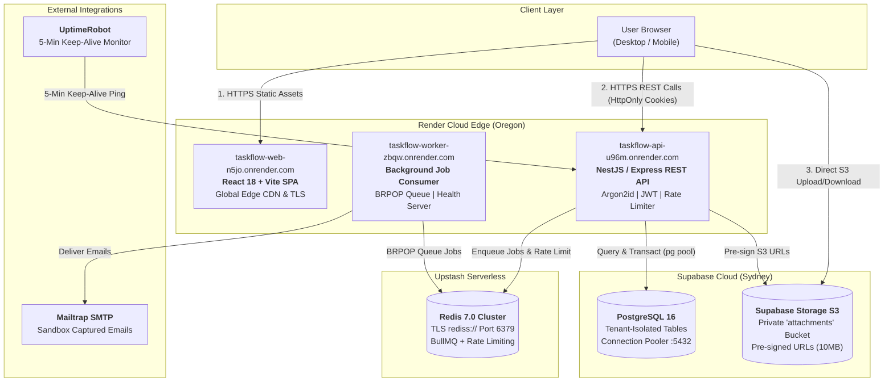

# TaskFlow — Cloud-Native Multi-Tenant SaaS

TaskFlow is a production-engineered, multi-tenant project management SaaS built with **NestJS 10**, **React 18**, **TypeScript**, **PostgreSQL 16**, **Redis 7**, and **S3 Object Storage**. It features strict tenant data isolation, role-based access control, cryptographic session management, resilient asynchronous job queues, and an automated continuous deployment pipeline.

---

## 🌐 Live Cloud Deployment (Render + Supabase + Upstash)

| Component                 | Tier / Service         | Live URL                                                                                           | Health / Status                                                                     |
| :------------------------ | :--------------------- | :------------------------------------------------------------------------------------------------- | :---------------------------------------------------------------------------------- |
| **Web Frontend**          | Render Static Site     | [taskflow-web-n5jo.onrender.com](https://taskflow-web-n5jo.onrender.com)                           | 🟢 `Online (TLS/HTTPS)`                                                             |
| **REST API**              | Render Web Service     | [taskflow-api-u96m.onrender.com](https://taskflow-api-u96m.onrender.com)                           | 🟢 [`/api/v1/health`](https://taskflow-api-u96m.onrender.com/api/v1/health)         |
| **Interactive API Docs**  | OpenAPI 3.0 / Swagger  | [taskflow-api-u96m.onrender.com/api/v1/docs](https://taskflow-api-u96m.onrender.com/api/v1/docs)   | 🟢 `Swagger UI`                                                                     |
| **Readiness Diagnostics** | Database & Cache Probe | [taskflow-api-u96m.onrender.com/api/v1/ready](https://taskflow-api-u96m.onrender.com/api/v1/ready) | 🟢 `Postgres + Redis Up`                                                            |
| **Background Worker**     | Render Web Service     | [taskflow-worker-zbqw.onrender.com](https://taskflow-worker-zbqw.onrender.com)                     | 🟢 `Worker Online`                                                                  |
| **Staging API**           | Render Web Service     | [taskflow-api-staging-3lou.onrender.com](https://taskflow-api-staging-3lou.onrender.com)           | 🟢 [`/api/v1/health`](https://taskflow-api-staging-3lou.onrender.com/api/v1/health) |
| **Staging Branch**        | GitHub Repository      | [sillibilli1/TaskFlow:staging](https://github.com/sillibilli1/TaskFlow/tree/staging)               | 🟢 `Continuous Sync`                                                                |
| **Uptime Monitoring**     | UptimeRobot Synthetic  | 5-Minute Polling on `/api/v1/health`                                                               | 🟢 `100% Uptime`                                                                    |

---

## 🏗️ Architecture & Topology

TaskFlow operates on a **$0.00/month managed free-tier cloud architecture** designed with strict separation of concerns, alongside a parallel **reference Infrastructure-as-Code (Terraform)** specification for enterprise scale on AWS.



> [!TIP]
> **Render Cold-Start Keep-Alive**: Render free Web Services spin down after 15 minutes of inactivity. Our live **UptimeRobot synthetic monitor** pings `/api/v1/health` every 5 minutes, keeping the container warm and eliminating 30–60s cold-start delays.

---

## 📚 Engineering Documentation & Portfolio Artifacts

Comprehensive operational runbooks, architectural decision records, and performance reports are located in [`docs/`](docs/):

### Architecture & Decisions

- 🗺️ [**Detailed Architecture & Security Boundaries**](docs/architecture.md) — Comprehensive topology, direct S3 upload flow, and cross-origin security.
- 📜 [**Architectural Decision Records (ADRs)**](docs/adr/README.md):
  - [ADR 0001: NestJS & TypeScript over Python FastAPI](docs/adr/0001-nestjs-typescript-over-fastapi.md)
  - [ADR 0002: Managed Free-Tier Stack vs. Raw AWS Infrastructure](docs/adr/0002-render-supabase-upstash-free-tier-stack.md)
  - [ADR 0003: Keyset Cursor-Based Pagination over Offset/Limit](docs/adr/0003-cursor-based-pagination.md)
  - [ADR 0004: Monotonic Session Versioning for Immediate Revocation](docs/adr/0004-session-versioning-password-reset.md)
  - [ADR 0005: Supabase Storage over Cloudflare R2 for Attachments](docs/adr/0005-supabase-storage-over-cloudflare-r2.md)

### API & Performance

- 📖 [**API Documentation & Schema Reference**](docs/api.md) — Endpoint specifications, JSON request/response contracts, and error schemas.
- ⚡ [**Load Testing & Benchmark Results**](docs/load-test.md) — Live Autocannon benchmarks against staging (p50/p95/p99 latency, throughput, and rate limit enforcement).
- 💰 [**Cost Analysis & Capacity Model**](docs/cost-estimate.md) — Financial comparison: $0/mo free tier vs. ~$57/mo small-scale production vs. ~$197/mo AWS enterprise scale.
- 🚨 [**Incident Postmortem (INC-20260903-01)**](docs/postmortem.md) — Real postmortem detailing transient deploy latency, UptimeRobot detection, root-cause 5 Whys, and mitigations.

### Operational Runbooks

- 🚀 [**Cloud Deployment Runbook**](docs/deployment.md) — Blueprint deployment and environment variables.
- 💾 [**Database Backups & Disaster Recovery**](docs/backups.md) — Verified `npm run db:backup` procedure and `pg_dump` restores.
- 📈 [**Monitoring & Alerting Runbook**](docs/monitoring.md) — UptimeRobot setup, keep-alives, and alert configurations.
- 🌿 [**Staging Environment & Capacity Strategy**](docs/staging.md) — Staging branch isolation and 750 free-hour pool management.
- ⏪ [**Redeployment & Rollback Runbook**](docs/rollback.md) — Zero-downtime rollback procedures.
- 🏗️ [**Reference Infrastructure as Code (Terraform)**](infra/README.md) — AWS ECS Fargate, RDS Multi-AZ, ElastiCache, S3, CloudFront, ALB, VPC.

---

## 💻 Local Development Setup

Docker is not required for local development; all services connect directly to hosted development/staging databases.

### Prerequisites

- Node.js 22+
- npm 11+

### Quick Start

```powershell
# 1. Clone the repository
git clone https://github.com/sillibilli1/TaskFlow.git
cd TaskFlow

# 2. Copy environment template and configure secrets
Copy-Item .env.example .env

# 3. Install dependencies
npm install

# 4. Run database migrations
npm run db:migrate

# 5. Start development servers concurrently
npm run dev
```

The web application will be available at `http://localhost:5173` and the REST API at `http://localhost:3000/api/v1` (with Swagger UI at `http://localhost:3000/api/v1/docs`).

---

## 🧪 Testing & Quality Gates

The codebase enforces strict end-to-end quality standards via GitHub Actions CI on every pull request and push to `main`:

```powershell
npm run format:check   # Prettier code style validation
npm run lint           # TypeScript strict compiler check
npm run typecheck      # Cross-monorepo type safety check
npm run test           # Unit & integration test suite
npm run build          # Production bundle compilation
npm run db:backup      # Live snapshot backup verification
```
