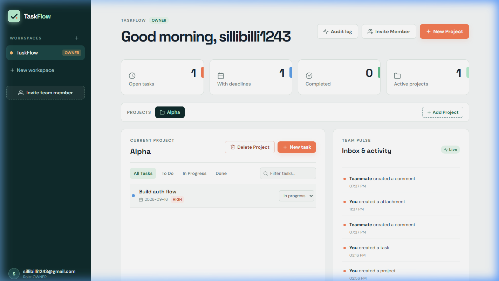
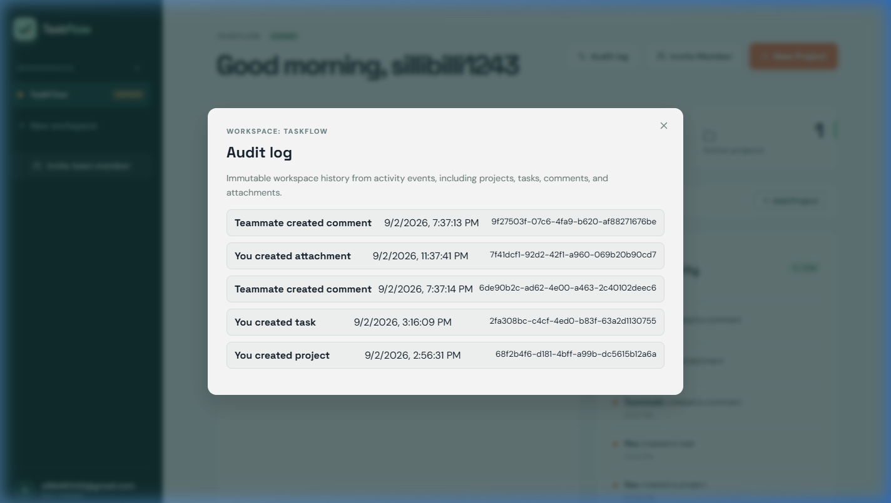
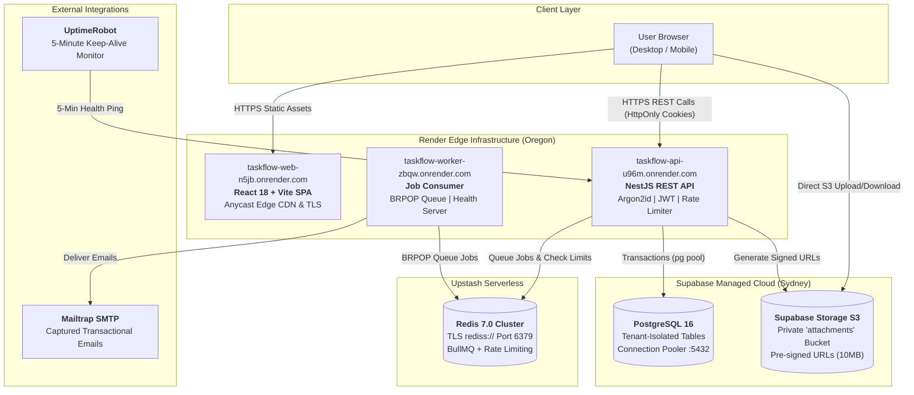

<div align="center">

# TaskFlow

**Enterprise-Grade Multi-Tenant Project Management Platform**

[](https://github.com/sillibilli1/TaskFlow/actions)
[](https://www.typescriptlang.org/)
[](https://nestjs.com/)
[](https://react.dev/)
[](https://www.postgresql.org/)
[](https://redis.io/)
[](https://render.com/)
[](LICENSE)

<p align="center">
  <a href="https://taskflow-web-n5jb.onrender.com"><strong>Explore Live Demo</strong></a> •
  <a href="https://taskflow-api-u96m.onrender.com/api/v1/docs"><strong>Interactive API Docs</strong></a> •
  <a href="docs/architecture.md"><strong>Architecture</strong></a> •
  <a href="docs/adr/README.md"><strong>Decisions (ADRs)</strong></a>
</p>

</div>

---

## Overview

TaskFlow is a production-engineered, multi-tenant project management SaaS engineered for agile software teams. Built with a decoupled modular architecture, TaskFlow enforces tenant-level data isolation, role-based authorization, cryptographic session management, resilient asynchronous job processing, and continuous deployment automation.

### Key Capabilities

- **Strict Tenant Isolation**: Workspace boundaries enforced at every layer with foreign key relationships and scoped composite query indexes.
- **Granular RBAC**: Tiered permission system (`Owner`, `Admin`, `Member`, `Viewer`) gating project mutations, member invitations, and audit telemetry.
- **Enterprise Security**: Argon2id password hashing, monotonic session versioning for immediate multi-device token revocation, and sliding-window rate limiting.
- **Direct S3 File Handling**: Pre-signed URL architecture for attachments up to 10MB, bypassing API memory buffers and offloading transfers directly to S3-compatible object storage.
- **Resilient Background Queues**: Asynchronous email delivery and event notifications powered by Redis-backed job workers with automated retry mechanics.
- **Optimistic UI & Idempotency**: Single-page application featuring optimistic state updates, UUIDv4 request deduplication via `Idempotency-Key` headers, and defensive timeouts.

---

## Application Interface

<div align="center">
  
  <p><em>Production Workspace Dashboard — Metrics overview, active projects, task boards, and live Team Pulse activity feed.</em></p>
</div>

<br />

<div align="center">
  
  <p><em>Immutable Workspace Audit Log — Complete chronological trace of projects, tasks, comments, and file attachments.</em></p>
</div>

---

## Live Cloud Environments

| Service                   | Environment | Platform           | URL                                                                                                | Health Check                                                                     |
| :------------------------ | :---------- | :----------------- | :------------------------------------------------------------------------------------------------- | :------------------------------------------------------------------------------- |
| **Web Client**            | Production  | Render Static Site | [taskflow-web-n5jb.onrender.com](https://taskflow-web-n5jb.onrender.com)                           | HTTPS CDN Active                                                                 |
| **REST API**              | Production  | Render Web Service | [taskflow-api-u96m.onrender.com](https://taskflow-api-u96m.onrender.com)                           | [`/api/v1/health`](https://taskflow-api-u96m.onrender.com/api/v1/health)         |
| **Swagger UI**            | Production  | OpenAPI 3.0        | [taskflow-api-u96m.onrender.com/api/v1/docs](https://taskflow-api-u96m.onrender.com/api/v1/docs)   | Interactive Docs                                                                 |
| **Readiness Diagnostics** | Production  | DB + Redis Health  | [taskflow-api-u96m.onrender.com/api/v1/ready](https://taskflow-api-u96m.onrender.com/api/v1/ready) | Postgres + Redis Up                                                              |
| **Background Worker**     | Production  | Render Web Service | [taskflow-worker-zbqw.onrender.com](https://taskflow-worker-zbqw.onrender.com)                     | Worker Online                                                                    |
| **Staging API**           | Staging     | Render Web Service | [taskflow-api-staging-3lou.onrender.com](https://taskflow-api-staging-3lou.onrender.com)           | [`/api/v1/health`](https://taskflow-api-staging-3lou.onrender.com/api/v1/health) |
| **Staging Branch**        | Staging     | GitHub             | [sillibilli1/TaskFlow:staging](https://github.com/sillibilli1/TaskFlow/tree/staging)               | Synchronized                                                                     |

> **Note on Free-Tier Spin-Down**: Render free Web Services spin down after 15 minutes of inactivity. An automated **UptimeRobot synthetic monitor** queries `/api/v1/health` at 5-minute intervals, keeping containers warm to eliminate cold-start delays.

---

## System Architecture

TaskFlow operates on a **$0.00/month managed cloud topology** balancing high developer velocity, zero fixed infrastructure cost, and enterprise security boundaries. A parallel **reference Infrastructure-as-Code (Terraform)** specification is maintained in [`infra/`](infra/README.md) for scaling to AWS.



---

## Documentation Index

### Architectural Decisions (ADRs)

- [ADR 0001: Selection of NestJS and TypeScript over Python FastAPI](docs/adr/0001-nestjs-typescript-over-fastapi.md)
- [ADR 0002: Managed Free-Tier Stack vs. Raw AWS Infrastructure](docs/adr/0002-render-supabase-upstash-free-tier-stack.md)
- [ADR 0003: Keyset Cursor-Based Pagination over Offset/Limit](docs/adr/0003-cursor-based-pagination.md)
- [ADR 0004: Monotonic Session Versioning for Multi-Device Invalidation](docs/adr/0004-session-versioning-password-reset.md)
- [ADR 0005: Supabase Storage over Cloudflare R2 for File Attachments](docs/adr/0005-supabase-storage-over-cloudflare-r2.md)

### Technical Specifications

- [Architecture & Security Boundaries](docs/architecture.md) — Detailed topology, S3 presigned URL flow, and security boundaries.
- [API Documentation & Schema Reference](docs/api.md) — Endpoint specifications, JSON request/response contracts, and error schemas.
- [Load Testing & Benchmark Results](docs/load-test.md) — Autocannon benchmarks against staging (p50/p95/p99 latency, throughput, and rate limiting).
- [Cost Analysis & Capacity Model](docs/cost-estimate.md) — Cost breakdown: $0/mo free tier vs. ~$57/mo production vs. ~$197/mo AWS enterprise scale.
- [Incident Postmortem: INC-20260903-01](docs/postmortem.md) — Postmortem analyzing deploy latency, UptimeRobot detection, root-cause 5 Whys, and mitigations.

### Operational Runbooks

- [Cloud Deployment Runbook](docs/deployment.md) — Blueprint deployment and environment variables.
- [Database Backups & Disaster Recovery](docs/backups.md) — Automated `npm run db:backup` procedure and `pg_dump` restores.
- [Monitoring & Alerting Runbook](docs/monitoring.md) — UptimeRobot setup, keep-alives, and alert configurations.
- [Staging Environment & Capacity Strategy](docs/staging.md) — Staging branch isolation and 750 free-hour pool management.
- [Redeployment & Rollback Runbook](docs/rollback.md) — Zero-downtime rollback procedures.
- [Reference Infrastructure as Code (Terraform)](infra/README.md) — AWS ECS Fargate, RDS Multi-AZ, ElastiCache, S3, CloudFront, ALB, VPC.

---

## Local Development

Local development connects directly to development cloud databases without requiring local Docker containers:

### Prerequisites

- Node.js 22+
- npm 11+

### Quick Start

```powershell
# 1. Clone repository
git clone https://github.com/sillibilli1/TaskFlow.git
cd TaskFlow

# 2. Setup environment variables
Copy-Item .env.example .env

# 3. Install workspace dependencies
npm install

# 4. Execute database migrations
npm run db:migrate

# 5. Launch development services
npm run dev
```

The web application will be accessible at `http://localhost:5173` and the REST API at `http://localhost:3000/api/v1` (with Swagger UI at `http://localhost:3000/api/v1/docs`).

---

## Quality & Continuous Integration

Quality validation executes automatically via GitHub Actions on every pull request and push to `main`:

```powershell
npm run format:check   # Prettier style validation
npm run lint           # TypeScript strict compiler check
npm run typecheck      # Cross-workspace type safety verification
npm run test           # Unit and integration test suite
npm run build          # Production bundle compilation
npm run db:backup      # Live snapshot backup verification
```

---

## License

This project is licensed under the MIT License — see the [LICENSE](LICENSE) file for details.
