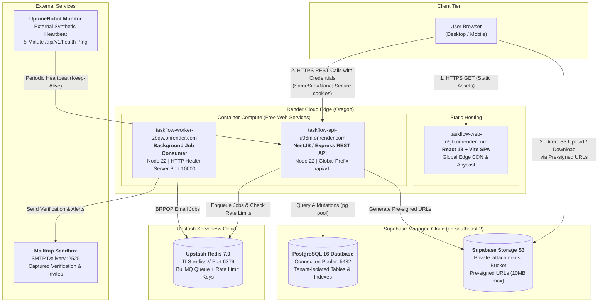

# TaskFlow Cloud Architecture

This document details the production architecture and live deployment topology of **TaskFlow**. The implementation utilizes managed free-tier cloud services to achieve a **$0.00/month operational cost** with enterprise-grade separation of concerns, high security, and auto-deploy pipelines.

---

## 1. Live Deployment Topology



---

## 2. Component Specifications

### A. Frontend Single Page Application (`taskflow-web`)

- **Framework**: React 18 with TypeScript and Vite.
- **Hosting**: Render Static Site with global CDN distribution.
- **Routing**: Client-side SPA routing with wildcard rewrite (`/*` → `/index.html`).
- **State & Communication**: Custom API client with automatic `Idempotency-Key` generation for mutation requests (`POST`, `PATCH`, `DELETE`), credentials forwarding (`credentials: "include"`), and a 10-second fail-safe request timeout.
- **Security**: Zero access to database credentials or service secrets; communicates exclusively over HTTPS with the backend API.

### B. Core REST API (`taskflow-api`)

- **Framework**: NestJS 10 built on top of Express with TypeScript.
- **Hosting**: Render Web Service (Node 22 runtime).
- **Security & Middleware**:
  - **Argon2id**: High-security cryptographic password hashing.
  - **Session Versioning**: Instantaneous multi-device revocation upon password reset via an incrementing `session_version` token payload.
  - **Dynamic CORS**: Intelligent origin validator permitting local dev (`localhost:5173`) and any `*.onrender.com` subdomain.
  - **Rate Limiting**: Sliding window rate limiter (60 mutations/minute per client IP) backed by Redis.
  - **Idempotency**: Automatic deduplication of mutations using `Idempotency-Key` headers stored in Redis.
- **Probes**:
  - `/api/v1/health`: Lightweight process liveness probe (< 2ms).
  - `/api/v1/ready`: Deep dependency readiness probe verifying PostgreSQL and Redis connectivity.
  - `/api/v1/docs`: Interactive OpenAPI 3.0 / Swagger interface.

### C. Background Worker (`taskflow-worker`)

- **Hosting**: Render Web Service operating on the free tier.
- **Architecture**:
  - Runs a background Redis polling loop (`BRPOP taskflow:jobs:email`).
  - Processes verification emails, password-reset instructions, and task notification dispatches.
  - Features an integrated Node HTTP server listening on `process.env.PORT` responding with `200 worker online\n` to pass Render's platform health checks.

### D. PostgreSQL Database (Supabase)

- **Engine**: PostgreSQL 16.3 running in AWS Asia-Pacific (Sydney).
- **Isolation**: Tenant boundary enforced on all queries by binding operations to `workspace_id` verified against `workspace_members`.
- **Schema Management**: Forward-compatible migrations tracked via an immutable `schema_migrations` ledger.

### E. In-Memory Cache & Queue (Upstash Redis)

- **Engine**: Redis 7.0 serverless cluster with TLS in-transit encryption.
- **Roles**:
  - Task job queue (`taskflow:jobs:email`).
  - Audit log and email delivery logging (`taskflow:sent_emails`).
  - IP-based mutation rate limiting sliding windows.
  - Idempotency key transaction caching (24-hour TTL).

### F. File Attachments (Supabase Storage)

- **Storage Type**: S3-compatible private object store (`attachments` bucket).
- **Direct Upload Flow**:
  1. Client calls `POST /api/v1/workspaces/:wId/tasks/:tId/attachments/presign`.
  2. API validates file type (jpg, png, webp, pdf, docx, xlsx, csv, txt) and size (<= 10MB), then generates a cryptographically signed upload URL via Supabase Storage API.
  3. Client uploads the file directly to object storage via HTTP `PUT`.
  4. Client notifies API via `POST .../complete` to commit metadata to the `attachments` table.

---

## 3. Security & Network Boundaries

```text
[ Internet / Public ]
      │ (HTTPS / TLS 1.3)
      ▼
[ Render Anycast Edge ]
      │
      ├───────────> [ taskflow-web ]  (Static Asset Distribution)
      │
      └───────────> [ taskflow-api ]  (REST Endpoints /api/v1/*)
                          │
                          ├──── (TLS Connection Pool) ───> [ Supabase Postgres:5432 ]
                          │
                          ├──── (TLS rediss://) ──────────> [ Upstash Redis:6379 ]
                          │
                          └──── (Signed HTTPS URLs) ─────> [ Supabase S3 Storage ]
```

- **Zero Unencrypted Channels**: All communication over public networks uses TLS 1.2/1.3.
- **Credentials Protection**: Database and Redis connection strings exist solely within Render server-side environment variables and are never bundled into client-side code.
- **Safe Cross-Subdomain Cookies**: Production authentication uses `SameSite=None; Secure; HttpOnly; Path=/` cookies, preventing JavaScript XSS access while supporting cross-origin requests between `taskflow-web` and `taskflow-api`.
