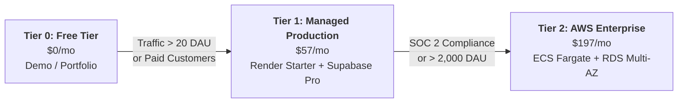

# TaskFlow Cost Analysis & Capacity Model

This document outlines the financial cost model for TaskFlow across three deployment tiers:

1. **Tier 0: Demonstration Free Tier** ($0/month) — Current live deployment.
2. **Tier 1: Small-Scale Production** (~100–500 active users, ~$57/month) — Managed SaaS stack.
3. **Tier 2: Enterprise Cloud Architecture** (At scale on AWS via Terraform, ~$177/month) — Reference IaC.

---

## 1. Cost Comparison Matrix

| Component                | Tier 0: Free Tier (Current)       | Tier 1: Small-Scale Production             | Tier 2: Enterprise AWS IaC             |
| :----------------------- | :-------------------------------- | :----------------------------------------- | :------------------------------------- |
| **API Compute**          | $0.00 (Render Free Web Service)   | $7.00 (Render Starter, 0.5 CPU/512MB)      | $30.00 (AWS ECS Fargate 2 Tasks)       |
| **Worker Compute**       | $0.00 (Render Free Web Service)   | $7.00 (Render Starter, 0.5 CPU/512MB)      | $15.00 (AWS ECS Fargate 1 Task)        |
| **Static Web App**       | $0.00 (Render Static Site)        | $0.00 (Render Static Site + Custom Domain) | $5.00 (AWS S3 + CloudFront Edge)       |
| **Database**             | $0.00 (Supabase Free, 500MB)      | $25.00 (Supabase Pro, 8GB + Daily Backups) | $58.00 (Amazon RDS Postgres Multi-AZ)  |
| **Redis Cache / Queue**  | $0.00 (Upstash Free, 10k cmd/day) | $3.00 (Upstash Serverless Usage)           | $13.00 (Amazon ElastiCache t4g.micro)  |
| **File Storage**         | $0.00 (Supabase Storage, 1GB)     | Included in Supabase Pro (100GB)           | $3.00 (Amazon S3 Standard)             |
| **Load Balancing / NAT** | $0.00 (Render Anycast Edge)       | $0.00 (Included with Render)               | $55.00 (AWS ALB + NAT Gateway)         |
| **Transactional Email**  | $0.00 (Mailtrap Sandbox)          | $15.00 (Resend / SendGrid 40k emails)      | $2.00 (Amazon SES)                     |
| **Secrets & KMS**        | $0.00 (Render Env Encrypted)      | $0.00 (Render Env Encrypted)               | $5.00 (AWS Secrets Manager + KMS)      |
| **Monitoring**           | $0.00 (UptimeRobot 5-min)         | $0.00 (UptimeRobot 50 monitors)            | $11.00 (AWS CloudWatch Alarms/Metrics) |
| **Total Monthly Cost**   | **$0.00 / month**                 | **~$57.00 / month**                        | **~$197.00 / month**                   |

---

## 2. Tier 0: Free-Tier Architecture ($0.00 / month)

### Current Live Architecture:

- **Render**: Hosts `taskflow-web` (Static Site), `taskflow-api` (Free Web Service), and `taskflow-worker` (Free Web Service).
- **Supabase**: Managed PostgreSQL 16 database and private S3-compatible attachments bucket.
- **Upstash**: Serverless Redis handling job queues and mutation rate limiting.
- **Mailtrap**: Captures verification and notification emails in a developer sandbox.
- **UptimeRobot**: Free synthetic health polling every 5 minutes.

### Constraints:

- Render services experience 30–60s cold starts after 15 minutes of inactivity (mitigated by UptimeRobot).
- Combined free instance-hour quota is capped at 750 hours/month.
- Supabase projects pause after 7 days without queries.

---

## 3. Tier 1: Small-Scale Production (~$57.00 / month)

Recommended when launching with paying customers or supporting a team of 100–500 daily active users.

### Architecture Changes:

1. **Render Starter Upgrade ($14/mo)**:
   - Upgrade `taskflow-api` ($7/mo) and `taskflow-worker` ($7/mo) from Free to Starter tier.
   - **Immediate Benefit**: Zero inactivity spin-down; continuous 24/7 background worker polling; dedicated CPU and 512MB RAM without memory throttling during deploys.
2. **Supabase Pro Upgrade ($25/mo)**:
   - Eliminates the 7-day inactivity pause.
   - Unlocks 7-day automated Point-in-Time Recovery (PITR) and daily automated backups.
   - Increases storage to 8GB database disk, 100GB file storage, and 50GB bandwidth egress.
   - Expands direct PostgreSQL connection pool from 15 to 60 connections.
3. **Upstash Serverless Scale (~$3/mo)**:
   - Converts from free 10,000 commands/day to pay-as-you-go ($0.20 per 100,000 requests).
4. **Production Email Delivery ($15/mo)**:
   - Switch from Mailtrap sandbox to Resend or Postmark for deliverability to real user inboxes.

### Unit Economics:

- **Cost per User (at 100 DAU)**: ~$0.57 / user / month.
- **Cost per User (at 500 DAU)**: ~$0.11 / user / month.
- **Gross Margin**: At a $10/user/month SaaS price point, infrastructure costs represent < 6% of revenue.

---

## 4. Tier 2: Enterprise Cloud Scale on AWS (~$197.00 / month)

For enterprise compliance (SOC 2, ISO 27001, HIPAA), strict VPC network isolation, and high-throughput autoscaling. Implemented as reference Infrastructure-as-Code in [`infra/`](file:///f:/grok/project%201/infra/).

### Architecture Components:

- **Networking**: Multi-AZ AWS VPC across 2 Availability Zones with public subnets, private subnets, and an AWS NAT Gateway for secure outbound egress.
- **Compute**: AWS ECS Fargate cluster with automated task autoscaling based on CPU/memory thresholds, fronted by an Application Load Balancer with ACM managed TLS certificates.
- **Database**: Amazon RDS PostgreSQL 16 Multi-AZ instance (`db.t4g.micro` or `db.t4g.small`) with automated failover and encrypted EBS storage.
- **Cache**: Amazon ElastiCache for Redis Multi-AZ cluster with in-transit and at-rest encryption.
- **Storage**: Amazon S3 bucket with strict private IAM bucket policies and CloudFront CDN.

---

## 5. Transition Triggers & Roadmap

| Metric / Threshold            | Current Value | Trigger for Tier 1 Upgrade | Trigger for Tier 2 Upgrade |
| :---------------------------- | :------------ | :------------------------- | :------------------------- |
| **Daily Active Users**        | < 10          | > 50 DAU                   | > 2,000 DAU                |
| **Concurrent DB Connections** | 2–5           | > 12 connections           | > 50 connections           |
| **Daily Redis Operations**    | < 1,000       | > 8,000 commands/day       | > 500,000 commands/day     |
| **Monthly Attachment Egress** | < 100 MB      | > 1.5 GB / month           | > 100 GB / month           |
| **Compliance Requirement**    | None          | Standard SLA               | SOC 2 / Dedicated VPC      |
